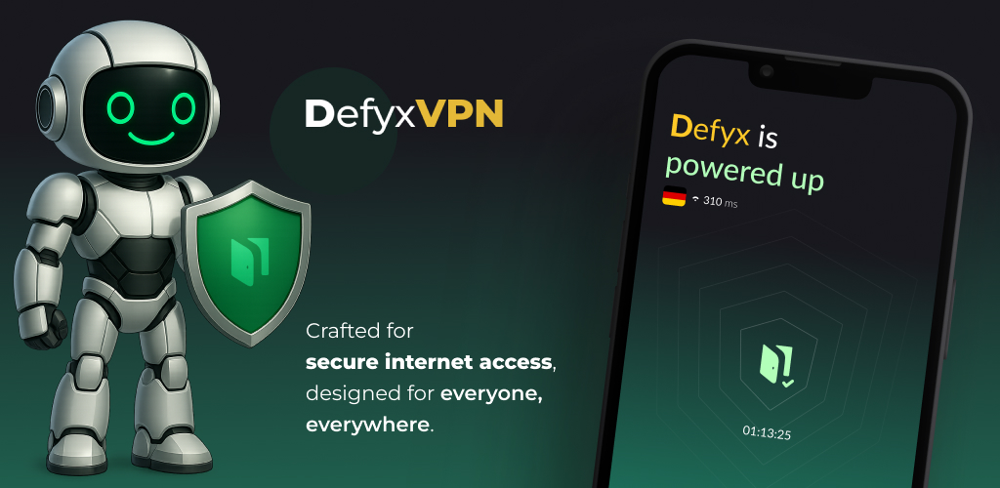

# Defyx VPN

A modern, relatively smart, secure, and open-source VPN application built with Flutter, providing free internet access and privacy protection with a fresh user experience.



## Features

- Simple, with a beautiful and user-friendly interface
- One-tap connect/disconnect functionality
- Powered by Warp, Psiphon, Warp-in-Warp, Xray, & Outline cores
- Relatively smart, requiring no manual configuration
- Ability to test internet speed and quality

## Installation

### Prerequisites

- Flutter SDK ≥ 3.7.0
- Dart SDK ≥ 3.0.0
- Xcode for iOS/macOS development

### 🧑‍💻 How to Set Up

1. Install dependencies:

```bash
flutter pub get
```

2. Run the application:

```bash
flutter run
```

3. Build for iOS:

```bash
make build-ios
```

This will:

- Clean the Flutter build
- Clean pub cache
- Build the IPA file

## Usage

1. Launch the app
2. Tap the connect button to secure your connection
3. Use the speed test feature to check your connection performance
4. Share the app with friends to spread internet freedom

## Technical Architecture

The app is built using:

- Flutter framework with Dart
- Riverpod for state management
- Native platform channels for VPN functionality
- Custom UI with Material Design components

## License

This project is licensed under the MIT License. See the [LICENSE](LICENSE) file for details.

## Third-Party Licenses

This project uses the following third-party components:

- [Warp-Plus](https://github.com/bepass-org/warp-plus): License type and copyright © respective owners. Please refer to the official Warp Plus documentation for license details.
- [Outline](https://github.com/Jigsaw-Code/outline-apps): License type and copyright © respective owners. Please refer to the official Outline documentation for license details.
- [Xray](https://github.com/XTLS/Xray-core): License type and copyright © respective owners. Please refer to the official Xray documentation for license details.

## Support

For support or inquiries, please [create an issue](https://github.com/UnboundTechCo/defyxVPN/issues) or contact us at info@UnboundTechCo.de.

---

Made with ❤️ by the UnboundTechCo Team
